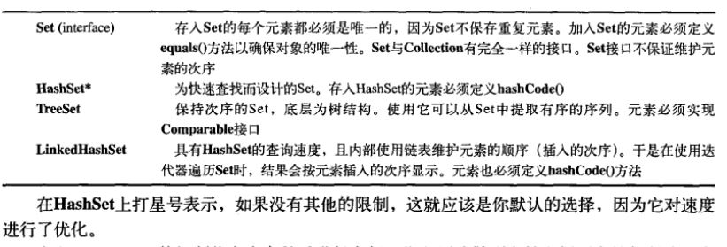
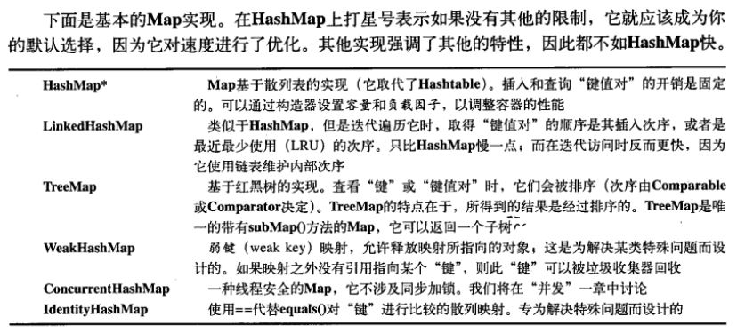

# 容器深入研究
## 填充容器
[FillingLists.java](./FillingLists.java)

### 一种Generator解决方案
[CollectionDataTest.java](./CollectionDataTest.java)

...

## 可选操作
执行各种不同的添加和移除的方法在Collection接口中都是可选操作  

## List的功能方法.
List很容易使用: add()添加对象, get()一次取出一个远古三, 调用iterator()获取Iterator

## Set和存储顺序

### SortedSet
SortedSet中的元素可以保证处于排序状态  

## 队列
除了并发应用Queue在Java SE5中仅有两个实现:LinkedList和PriorityQueue

### 优先队列
通过Comparable进行控制

### 双向队列
Java标准库中没有此接口

## 理解Map
标准的Java类库:HashMap, TreeMap, LinkedHashMap, WeakHashMap, ConcurrentHashMap, IdentityHashMap

### 性能

### SortedMap
TreeMap是其现阶段的唯一实现, 可以确保键处于排序状态

### LinkedHashMap
散列化所有元素, 但是在遍历键值对时,以元素的插入顺序返回键值对  

## 散列与散列码
...

