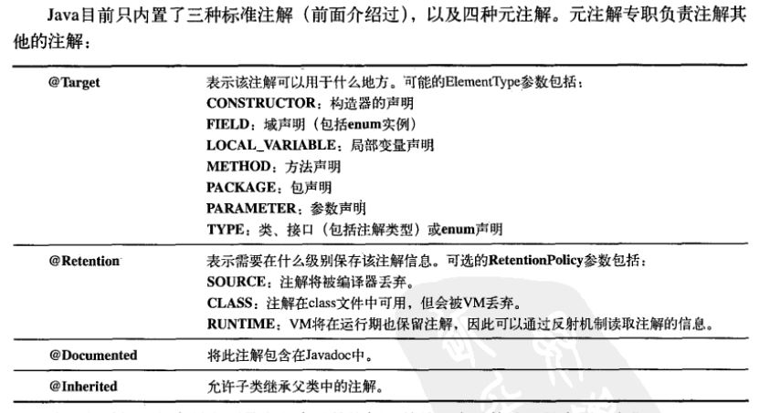

# 注解
### 定义注解
[UseCase.java](./UseCase.java)

### 元注解

## 编写注解处理器
[UseCaseTracker.java](./UseCaseTracker.java)
### 注解元素
注解元素可用的类型:
- String
- Class
- enum
- Annotation
- 以上类型的数组

### 默认值限制
元素不能有不确定的值: 要么具有默认值, 要么在使用注解时提供元素的值  

对于非基本类型的元素, 无论是在源代码中声明时, 或是在注解接口中定义默认值时, 都不能以null为其值.  

### 生成外部文件
...